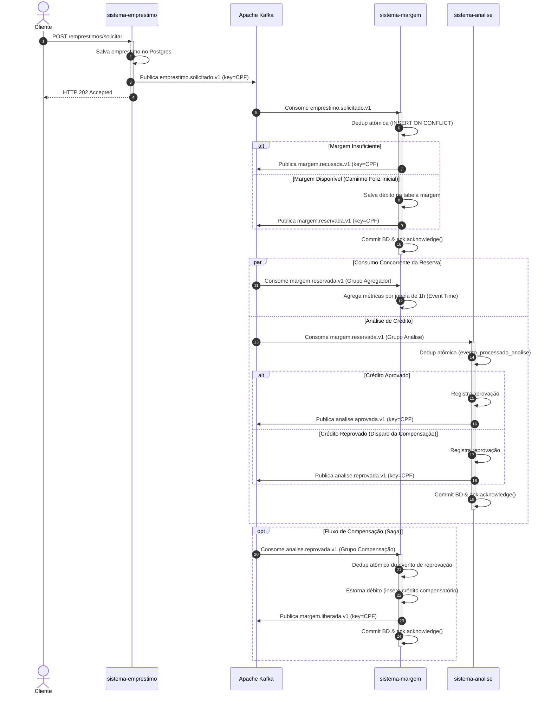

# Documento de Arquitetura de Software — CredFolha

**AED · Arquitetura Reativa e Event-Driven · Equipe 06**  
**Domínio:** Empréstimo Consignado — Reserva de Margem, Análise de Crédito e Compensação  

---

## 1. Contexto e Problema de Negócio

Empresas de crédito consignado operam em um ambiente altamente regulado, no qual descontos em folha de pagamento dependem estritamente da existência de **margem consignável disponível** do trabalhador. Conceder um empréstimo acima do limite legal acarreta severas sanções jurídicas e financeiras; por outro lado, reter margem indevidamente impede o cliente de acessar crédito em outras instituições.

O fluxo de concessão integra múltiplos domínios de negócio autônomos:
1. **Atendimento / Originação:** Interface de captação do pedido do cliente.
2. **Custódia de Margem:** Controle contábil estrito da margem salarial, somando créditos e débitos por CPF.
3. **Análise de Crédito / Risco:** Avaliação externa de capacidade de pagamento e perfil de crédito.

O grande desafio arquitetural reside em garantir consistência eventual entre esses sistemas heterogêneos sem recorrer a acoplamento temporal (bloqueios síncronos) ou transações distribuídas (2PC/XA), assegurando que qualquer reprovação posterior resulte na liberação imediata e auditável da margem salarial reservada.

---

## 2. Modelo de Eventos e Contratos

A integração entre os serviços é realizada exclusivamente por **eventos de domínio assíncronos** publicados no Apache Kafka, envelopados na especificação **CloudEvents 1.0 em modo binário**.

### 2.1 Metadados do Envelope (Headers Kafka)

| Header | Tipo | Descrição |
|---|---|---|
| `ce_specversion` | String | Versão da especificação CloudEvents (`1.0`). |
| `ce_id` | String (UUID v4) | Identificador único **da publicação do fato**. Utilizado para deduplicação idempotente. |
| `ce_source` | String | Identificador do serviço emissor (ex: `sistema-margem`). |
| `ce_type` | String | Tipo e versão formal do contrato (ex: `margem.reservada.v1`). |
| `ce_time` | String (ISO-8601 UTC) | Instante em que o fato de negócio ocorreu no banco do produtor (`Instant.toString()`). |

### 2.2 Tópicos e Eventos de Domínio

| Tópico | Evento | Produtor | Consumidores |
|---|---|---|---|
| `emprestimo.solicitado.v1` | `EmprestimoSolicitadoEvent` | `sistema-emprestimo` | `sistema-margem` |
| `margem.reservada.v1` | `MargemReservadaEvent` | `sistema-margem` | `sistema-analise`, `sistema-margem` (agregador) |
| `margem.recusada.v1` | `MargemRecusadaEvent` | `sistema-margem` | Sistema de Notificação / Auditoria |
| `analise.aprovada.v1` | `AnaliseAprovadaEvent` | `sistema-analise` | Sistema de Liquidação / Pagamento |
| `analise.reprovada.v1` | `AnaliseReprovadaEvent` | `sistema-analise` | `sistema-margem` (compensação) |
| `margem.liberada.v1` | `MargemLiberadaEvent` | `sistema-margem` | Auditoria / Notificação ao Cliente |

### 2.3 Regra de Compatibilidade: BACKWARD
O contrato adota evolução **BACKWARD**:
- Consumidores declaram apenas os campos que utilizam (`@JsonIgnoreProperties(ignoreUnknown = true)`).
- Novos campos adicionados pelo produtor devem ser sempre opcionais com valores *default*.
- A chave de partição de todos os tópicos é o **CPF** do cliente, garantindo ordem estrita por titular.

---

## 3. Diagrama do Fluxo Completo

O diagrama abaixo ilustra o fluxo fim a fim coreografado, contemplando o caminho feliz, as recusas de negócio e o caminho de exceção com compensação:

---

## 4. Decisões Arquiteturais Registradas

1. **[ADR-001] Três serviços Maven independentes:** Sem POM pai e sem biblioteca JAR de contratos compartilhada. O desacoplamento é 100% no fio (JSON + CloudEvents).
2. **[ADR-002] Domínio de Crédito Consignado:** Modelagem de 4 critérios fundamentais: regra interna de decisão, dois sistemas externos, caminho de exceção com compensação real e projeção analítica que justifica reprocessamento.
3. **[ADR-003] Ambiente de Execução Declarado:** Uso de `.devcontainer/devcontainer.json` com Java 21 e `docker-in-docker`, separando `compose.yml` para infraestrutura e testes com Kafka embutido.
4. **[ADR-006] Saga por Coreografia Reativa:** Descentralização da coordenação da transação compensatória sem ponto único de falha, utilizando fatos de domínio no particípio (`AnaliseReprovada` acionando `MargemLiberada`).

---

## 5. Tratamento de Falhas e Resiliência (Quando Falha)

A arquitetura adota a garantia de entrega **at-least-once** combinada com **consumo estritamente idempotente**:

### 5.1 Idempotência Transacional
- Cada consumidor mantém uma tabela de controle de deduplicação (`evento_processado` no `sistema-margem` e `evento_processado_analise` no `sistema-analise`).
- O registro é atômico via `INSERT INTO evento_processado (evento_id) VALUES (?) ON CONFLICT DO NOTHING`.
- O efeito de negócio (ex: gravação da margem) e o registro do dedup acontecem **dentro do mesmo método `@Transactional`** (mesmo commit do Postgres).
- A confirmação do offset do Kafka (`ack.acknowledge()`) só ocorre **após o commit da transação**.

### 5.2 Diferenciação entre Falhas Transitórias e Permanentes
Configurado via `CommonErrorHandler` (`DefaultErrorHandler`):
- **Falhas Transitórias (ex: queda momentânea de conexão com o banco de dados):**
  - O consumidor entra em retentativa com política de backoff fixo (3 tentativas espaçadas em 1.000 ms).
  - Caso o recurso volte a operar, a transação é completada com sucesso.
- **Falhas Permanentes (ex: mensagens com JSON malformado ou violação de contrato irrecuperável):**
  - Exceções como `IllegalArgumentException` e `SerializationException` são declaradas como *not-retryable*.
  - A mensagem é encaminhada imediatamente para a **Dead Letter Queue (DLQ)** do tópico correspondente (ex: `emprestimo.solicitado.v1.dlq`).
  - O `DeadLetterPublishingRecoverer` preserva integralmente os cabeçalhos CloudEvents originais (`ce_*`) e anexa os metadados de diagnóstico (`kafka_dlt-exception-fqcn`, `kafka_dlt-exception-message`, `kafka_dlt-exception-stacktrace`).

---

## 6. Agregação e Escalabilidade (Quando Cresce)

### 6.1 Escala por Particionamento
- O tópico `margem.reservada.v1` possui 3 partições.
- Com a chave de partição fixada no `CPF`, todos os eventos referentes ao mesmo cliente trafegam sequencialmente na mesma partição, eliminando condições de corrida na apuração de margem individual.
- É possível escalar os consumidores horizontalmente em até 3 instâncias por grupo consumidor sem perder a ordenação por cliente.

### 6.2 O Agregador por Janela Temporal (Etapa 2 / Aula 03)
Para responder à demanda analítica de apuração de liquidez sem impactar a performance do banco transacional:
- Um consumidor com grupo próprio (`sistema-margem-agregador`) escuta `margem.reservada.v1`.
- Agrega as reservas em **Tumbling Windows** de 1 hora baseadas estritamente no **Event Time** (`ce_time`).
- Se eventos chegarem com atraso (*late events*), o agregador calcula o timestamp original do fato e atualiza retroativamente o acumulador da janela correspondente, garantindo integridade contábil mesmo em caso de reprocessamento histórico integral do tópico.

---

## 7. Observabilidade e Operação (O que se Enxerga)

1. **Rastreabilidade de Ponta a Ponta:**
   - **`ce_id`:** Identidade única de cada publicação, permitindo rastrear entregas repetidas e logs de dedup.
   - **`solicitacaoId`:** Identificador de correlação de negócio que atravessa os três serviços (`Emprestimo` $\rightarrow$ `Margem` $\rightarrow$ `Analise` $\rightarrow$ `Compensacao`).
2. **Logs Estruturados:**
   - Registros explícitos em nível `INFO` registrando o processamento, offset, partição e descarte em silêncio de duplicatas.
3. **Kafka UI (`http://localhost:8089`):**
   - Inspeciona filas, defasagem de consumo (*consumer lag*), partições e payloads com cabeçalhos binários decodificados.
4. **Postgres CLI / Consultas de Auditoria:**
   - Verificação do razão contábil em tempo real via tabela `margem` e histórico de decisões em `analise`.

---

## 8. O que Ficou de Fora e Custos de Implementação

Conforme documentado no histórico de ADRs e aceito pela equipe:

1. **Cálculo Real de Score de Crédito:** Mantido deliberadamente como "caixa-preta" determinística (regra do dígito verificador do CPF no `sistema-analise`), evitando desviar o foco da arquitetura orientada a eventos para regras financeiras de concessão.
2. **Orquestrador Central:** Descartado no [ADR-006](adr/ADR-006-saga-e-compensacao.md). O custo aceito é a ausência de uma consulta única de status global, compensado pela independência e resiliência dos microsserviços.
3. **Múltiplos Empréstimos Simultâneos e Renegociação:** Ficaram fora do escopo desta etapa. Cada solicitação é avaliada atomicamente sobre a margem remanescente.
4. **Empacotamento em Imagens Docker por Serviço:** Conforme [ADR-003](adr/ADR-003-ambiente-de-execucao.md), os serviços continuam rodando via `./mvnw spring-boot:run` ou via container compartilhado no Compose de suporte, priorizando o ciclo de desenvolvimento rápido e a clareza dos logs isolados.
