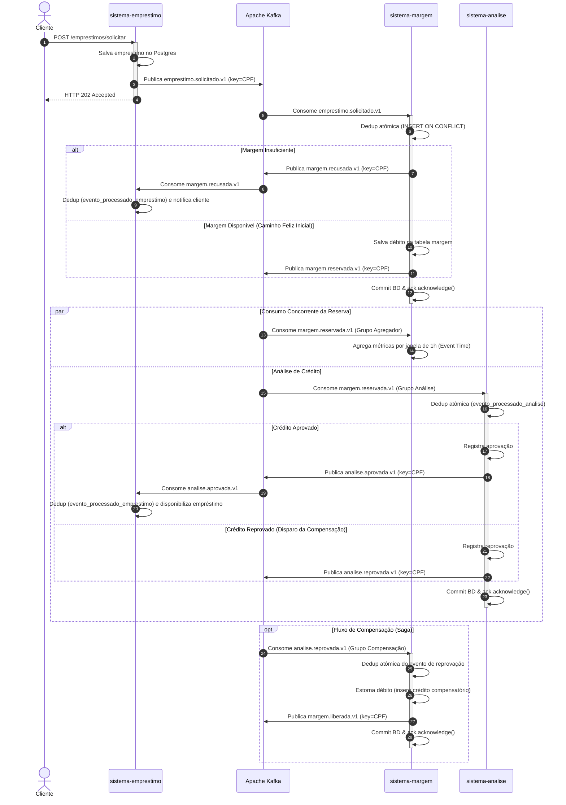

# Documento de Arquitetura de Software — CredFolha

**AED · Arquitetura Reativa e Event-Driven · Equipe 06**  
**Domínio:** Empréstimo Consignado — Reserva de Margem, Análise de Crédito e Compensação  

---

## 1. Contexto e Problema de Negócio

Empresas de crédito consignado operam em um ambiente altamente regulado, no qual descontos em folha de pagamento dependem estritamente da existência de **margem consignável disponível** do trabalhador. Conceder um empréstimo acima do limite legal acarreta severas sanções jurídicas e financeiras; por outro lado, reter margem indevidamente impede o cliente de acessar crédito em outras instituições.

O fluxo de concessão integra múltiplos domínios de negócio autônomos:
1. **Atendimento / Originação:** Interface de captação do pedido do cliente.
2. **Custódia de Margem:** Controle contábil estrito da margem salarial, somando créditos e débitos por CPF.
3. **Análise de Crédito / Risco:** Avaliação externa de capacidade de pagamento e perfil de crédito.

O grande desafio arquitetural reside em garantir consistência eventual entre esses sistemas heterogêneos sem recorrer a acoplamento temporal (bloqueios síncronos) ou transações distribuídas (2PC/XA), assegurando que qualquer reprovação posterior resulte na liberação imediata e auditável da margem salarial reservada.

---

## 2. Modelo de Eventos e Contratos

A integração entre os serviços é realizada exclusivamente por **eventos de domínio assíncronos** publicados no Apache Kafka, envelopados na especificação **CloudEvents 1.0 em modo binário**.

### 2.1 Metadados do Envelope (Headers Kafka)

| Header | Tipo | Descrição |
|---|---|---|
| `ce_specversion` | String | Versão da especificação CloudEvents (`1.0`). |
| `ce_id` | String (UUID v4) | Identificador único **da publicação do fato**. Utilizado para deduplicação idempotente. |
| `ce_source` | String | Identificador do serviço emissor (ex: `sistema-margem`). |
| `ce_type` | String | Tipo e versão formal do contrato (ex: `margem.reservada.v1`). |
| `ce_time` | String (ISO-8601 UTC) | Instante em que o fato de negócio ocorreu no banco do produtor (`Instant.toString()`). |

### 2.2 Tópicos e Eventos de Domínio

| Tópico | Evento | Produtor | Consumidores |
|---|---|---|---|
| `emprestimo.solicitado.v1` | `EmprestimoSolicitadoEvent` | `sistema-emprestimo` | `sistema-margem` |
| `margem.reservada.v1` | `MargemReservadaEvent` | `sistema-margem` | `sistema-analise`, `sistema-margem` (agregador) |
| `margem.recusada.v1` | `MargemRecusadaEvent` | `sistema-margem` | `sistema-emprestimo` (notificação ao cliente) |
| `analise.aprovada.v1` | `AnaliseAprovadaEvent` | `sistema-analise` | `sistema-emprestimo` (disponibilização do empréstimo) |
| `analise.reprovada.v1` | `AnaliseReprovadaEvent` | `sistema-analise` | `sistema-margem` (compensação) |
| `margem.liberada.v1` | `MargemLiberadaEvent` | `sistema-margem` | Auditoria / Notificação ao Cliente |

### 2.3 Regra de Compatibilidade: BACKWARD
O contrato adota evolução **BACKWARD**:
- Consumidores declaram apenas os campos que utilizam (`@JsonIgnoreProperties(ignoreUnknown = true)`).
- Novos campos adicionados pelo produtor devem ser sempre opcionais com valores *default*.
- A chave de partição de todos os tópicos é o **CPF** do cliente, garantindo ordem estrita por titular.

### 2.4 Tópicos de Dead Letter Queue (DLQ)

O `sistema-margem` e o `sistema-analise` encaminham falhas para `<tópico de origem>.dlq`, na mesma partição do registro original. Apenas duas DLQs são declaradas explicitamente, com 3 partições:

| DLQ | Criada por | Recebe falhas de |
|---|---|---|
| `emprestimo.solicitado.v1.dlq` | `sistema-margem` | grupo `sistema-margem` |
| `margem.reservada.v1.dlq` | `sistema-analise` | grupos `sistema-analise` e `sistema-margem-agregador` |

- Como `margem.reservada.v1` tem dois grupos consumidores, um registro com falha nos dois grupos aparece **duas vezes** na DLQ, uma por grupo.
- Falhas no grupo `sistema-margem-compensacao` são roteadas para `analise.reprovada.v1.dlq`, que não é declarada: o broker a cria automaticamente na primeira falha (`auto.create.topics.enable`), com 1 partição, e o recoverer deixa o produtor escolher a partição.
- O `sistema-emprestimo` **não usa DLQ**: esgotadas as retentativas, o registro é logado e descartado (ver 5.2).

---

## 3. Diagrama do Fluxo Completo

O diagrama abaixo ilustra o fluxo fim a fim coreografado, contemplando o caminho feliz, as recusas de negócio e o caminho de exceção com compensação:

---

## 4. Decisões Arquiteturais Registradas

1. **[ADR-001] Três serviços Maven independentes:** Sem POM pai e sem biblioteca JAR de contratos compartilhada. O desacoplamento é 100% no fio (JSON + CloudEvents).
2. **[ADR-002] Domínio de Crédito Consignado:** Modelagem de 4 critérios fundamentais: regra interna de decisão, dois sistemas externos, caminho de exceção com compensação real e projeção analítica que justifica reprocessamento.
3. **[ADR-003] Ambiente de Execução Declarado:** Uso de `.devcontainer/devcontainer.json` com Java 21 e `docker-in-docker`, separando `compose.yml` para infraestrutura e testes com Kafka embutido.
4. **[ADR-006] Saga por Coreografia Reativa:** Descentralização da coordenação da transação compensatória sem ponto único de falha, utilizando fatos de domínio no particípio (`AnaliseReprovada` acionando `MargemLiberada`).

---

## 5. Tratamento de Falhas e Resiliência (Quando Falha)

A arquitetura adota a garantia de entrega **at-least-once** combinada com **consumo estritamente idempotente**:

### 5.1 Idempotência Transacional
- Cada serviço consumidor mantém uma tabela de controle de deduplicação no banco compartilhado `aed`: `evento_processado` no `sistema-margem`, `evento_processado_analise` no `sistema-analise` e `evento_processado_emprestimo` no `sistema-emprestimo`.
- Exceção: o agregador (`sistema-margem-agregador`) acumula em memória e **não** é idempotente; uma reentrega é contada duas vezes.
- O registro é atômico via `INSERT INTO evento_processado (evento_id) VALUES (?) ON CONFLICT DO NOTHING`.
- O efeito de negócio (ex: gravação da margem) e o registro do dedup acontecem **dentro do mesmo método `@Transactional`** (mesmo commit do Postgres).
- A confirmação do offset do Kafka (`ack.acknowledge()`) só ocorre **após o commit da transação**.

### 5.2 Diferenciação entre Falhas Transitórias e Permanentes
Os três serviços declaram um `CommonErrorHandler` (`DefaultErrorHandler`) em seus `KafkaConfig`, com a mesma política de retentativa. Ele é aplicado tanto à factory automática do Spring Boot quanto às factories customizadas (`margemReservadaContainerFactory`, `analiseReprovadaContainerFactory`, `analiseAprovadaContainerFactory`).

| Serviço | Esgotadas as retentativas / falha permanente |
|---|---|
| `sistema-margem`, `sistema-analise` | `DeadLetterPublishingRecoverer` publica na DLQ (seção 2.4) |
| `sistema-emprestimo` | sem recoverer: o registro é logado em `ERROR` e descartado, e o consumo segue |

- **Falhas Transitórias (ex: queda de conexão com o banco de dados):**
  - Backoff exponencial (`ExponentialBackOffWithMaxRetries`): espera de 1s, 2s, 4s, 8s, 16s e depois 30s (teto), com até **8 retentativas** (9 tentativas no total).
  - O pool Hikari usa `connection-timeout: 5000`, então cada tentativa com o banco fora falha em ~5s em vez dos 30s padrão.
  - A transação da tentativa que falhou é revertida, inclusive o registro de dedup, e a tentativa seguinte processa o evento do zero.
  - Se o recurso voltar dentro da janela, a transação é concluída normalmente. **Tolerância medida** (`sistema-margem`): com o Postgres parado, o registro foi para a DLQ **2m46s** após a publicação.
  - Esgotadas as retentativas, no `sistema-margem` e no `sistema-analise` o registro vai para a DLQ com o payload completo, preservando `ce_id` para reprocessamento idempotente. No `sistema-emprestimo` ele é descartado.
- **Falhas Permanentes (sem retentativa):**
  - **Desserialização:** os consumidores usam `ErrorHandlingDeserializer` delegando ao `JacksonJsonDeserializer`. Um JSON malformado não trava mais a partição: a `DeserializationException` é entregue ao error handler e os registros seguintes continuam sendo consumidos. No `sistema-margem` e no `sistema-analise` o registro vai para a DLQ com os **bytes originais** (template dedicado com `ByteArraySerializer`); no `sistema-emprestimo` é logado e descartado.
  - `IllegalArgumentException`, `SerializationException` e as exceções não retentáveis padrão do Spring Kafka (`DeserializationException`, `MessageConversionException`, `ClassCastException`, entre outras).
- **Registro sem `ce_id`:** descartado pelo listener com log `ERROR` e offset confirmado, sem passar pela DLQ.
- O `DeadLetterPublishingRecoverer` preserva os cabeçalhos CloudEvents originais (`ce_*`) e anexa os metadados de diagnóstico (`kafka_dlt-exception-fqcn`, `kafka_dlt-exception-cause-fqcn`, `kafka_dlt-exception-message`, `kafka_dlt-exception-stacktrace`, `kafka_dlt-original-*`).

### 5.3 Limitações Conhecidas
- **`sistema-emprestimo` sem DLQ:** eventos `margem.recusada.v1` e `analise.aprovada.v1` que falharem após as retentativas ficam só no log; o reprocessamento exige reler o tópico de origem.
- **Sem reprocessamento automático da DLQ:** nenhum serviço consome os tópicos `.dlq`. O reprocessamento é manual (republicar no tópico de origem); a idempotência por `ce_id` evita efeito duplicado.
- **Offset do registro enviado à DLQ não é confirmado** no modo `MANUAL_IMMEDIATE`: o consumidor em execução avança, mas o grupo mantém lag 1. Ao reiniciar o serviço, o registro é lido de novo (a idempotência cobre).
- **Publicação não transacional:** o `KafkaTemplate.send()` é assíncrono dentro do `@Transactional` e a falha só é logada. Com o Kafka fora do ar, o banco confirma, o offset avança e o próximo evento da saga não é emitido. Se o commit do banco falhar após o envio, a retentativa publica de novo com **outro `ce_id`**, e o consumidor seguinte não deduplica. O mesmo vale para o `POST /emprestimos/solicitar`, que responde `202` mesmo se a publicação falhar. A solução seria um *Transactional Outbox*.

---

## 6. Agregação e Escalabilidade (Quando Cresce)

### 6.1 Escala por Particionamento
- O tópico `margem.reservada.v1` possui 3 partições.
- Com a chave de partição fixada no `CPF`, todos os eventos referentes ao mesmo cliente trafegam sequencialmente na mesma partição, eliminando condições de corrida na apuração de margem individual.
- É possível escalar os consumidores horizontalmente em até 3 instâncias por grupo consumidor sem perder a ordenação por cliente.

### 6.2 O Agregador por Janela Temporal (Etapa 2 / Aula 03)
Para responder à demanda analítica de apuração de liquidez sem impactar a performance do banco transacional:
- Um consumidor com grupo próprio (`sistema-margem-agregador`) escuta `margem.reservada.v1`.
- Agrega as reservas em **Tumbling Windows** de 1 hora baseadas estritamente no **Event Time** (`ce_time`).
- Se eventos chegarem com atraso (*late events*), o agregador calcula o timestamp original do fato e atualiza retroativamente o acumulador da janela correspondente, garantindo integridade contábil mesmo em caso de reprocessamento histórico integral do tópico.

---

## 7. Observabilidade e Operação (O que se Enxerga)

1. **Rastreabilidade de Ponta a Ponta:**
   - **`ce_id`:** Identidade única de cada publicação, permitindo rastrear entregas repetidas e logs de dedup.
   - **`solicitacaoId`:** Identificador de correlação de negócio que atravessa os três serviços (`Emprestimo` $\rightarrow$ `Margem` $\rightarrow$ `Analise` $\rightarrow$ `Compensacao`).
2. **Logs Estruturados:**
   - Registros explícitos em nível `INFO` registrando o processamento, offset, partição e descarte em silêncio de duplicatas.
3. **Kafka UI (`http://localhost:8089`):**
   - Inspeciona filas, defasagem de consumo (*consumer lag*), partições e payloads com cabeçalhos binários decodificados.
   - Os tópicos `.dlq` mostram o registro que falhou e a causa nos cabeçalhos `kafka_dlt-exception-*`.
4. **Postgres CLI / Consultas de Auditoria:**
   - Verificação do razão contábil em tempo real via tabela `margem` e histórico de decisões em `analise`.

---

## 8. O que Ficou de Fora e Custos de Implementação

Conforme documentado no histórico de ADRs e aceito pela equipe:

1. **Cálculo Real de Score de Crédito:** Mantido deliberadamente como "caixa-preta" determinística (regra do dígito verificador do CPF no `sistema-analise`), evitando desviar o foco da arquitetura orientada a eventos para regras financeiras de concessão.
2. **Orquestrador Central:** Descartado no [ADR-006](adr/ADR-006-saga-e-compensacao.md). O custo aceito é a ausência de uma consulta única de status global, compensado pela independência e resiliência dos microsserviços.
3. **Múltiplos Empréstimos Simultâneos e Renegociação:** Ficaram fora do escopo desta etapa. Cada solicitação é avaliada atomicamente sobre a margem remanescente.
4. **Execução dos Serviços:** Cada serviço tem seu próprio `Dockerfile` (build Maven multi-stage) e está declarado no `compose.yml` sob o profile `domain` (`docker compose --profile domain up -d --build`). Sem o profile, o Compose sobe só a infraestrutura e os serviços rodam localmente via `./mvnw spring-boot:run`. Essa mudança revê a decisão original do [ADR-003](adr/ADR-003-ambiente-de-execucao.md), que previa apenas infraestrutura no Compose.
5. **Reprocessamento de DLQ e Transactional Outbox:** Ficaram fora desta etapa; ver [5.3 Limitações Conhecidas](#53-limitações-conhecidas).
